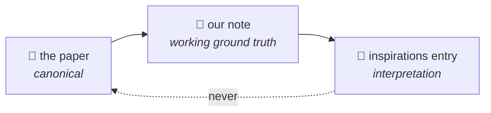

<div align="center">



*The research that made us want to build things, written down the way we'd want to be written down.*

[](https://arxiv.org/abs/2309.04269)
[](LICENSE.md)
-2ea44f)


</div>

> **A notes repo, not a mirror.** This repo is our reading of one paper —
> Adams et al., *From Sparse to Dense: GPT-4 Summarization with Chain of
> Density Prompting* ([arXiv:2309.04269](https://arxiv.org/abs/2309.04269)) —
> and, because that paper gave our note-taking its spine, it is also the
> canonical home of the methodology every OpenCnid paper repo follows. (Yes,
> we summarized the summarization paper with its own method. It felt rude not
> to.) No papers are hosted here and none ever will be. [The note](cod.md) is
> an original synthesis — our words, their findings, a citation at every level
> of the chain.

> [!IMPORTANT]
> **The one-way rule.** When a note and its paper disagree, the paper wins and
> the note gets fixed. No exceptions, no negotiation, no "but we liked our
> version better." That rule is the entire reason we can call these notes
> ground truth with a straight face.

**Every note is a chain, and the chain is the artifact.** A note starts sparse
and gets rewritten four times at fixed length, fusing in a few more salient
facts per round — methods, datasets, exact numbers, ablations, limitations —
and no fact enters the chain without a locator pointing back into the paper
(§ section, Table N, Figure N). We keep *all five tiers*, not just the densest:

| tier | what it is |
|---|---|
| **T1 — sparse** | the problem, the approach, the headline result. For readers whose coffee hasn't kicked in yet |
| **T2–T4** | same length each, folding in 2–3 more salient entities per round, every one with a locator. The plot thickens; the word count doesn't |
| **T5 — dense** | maximally fused, still readable, every claim traceable. The one you bring to a design review |
| **key results** | exact values from the source, never rounded, each with its table or figure |
| **our take** | the only opinionated section, clearly ours, quarantined like it's contagious (opinions are) |

## Why this exists

We're a new lab. The honest way to introduce yourself is to say who taught you —
precisely, with page numbers. (It's also considerably cheaper than a marketing
department.) OpenCnid Labs builds things because other people's research made
us want to, and we write that recognition down **one repo per paper, each named
after the paper it reads** — so the people actually searching for the research
can find our reading of it. This repo is the first, and it doubles as the
template:

- **[cod.md](cod.md)** — the five-tier note on the Chain of Density paper.
- **[METHOD.md](METHOD.md)** and
  **[the synthesis prompt](chain-of-density-synthesis-prompt.md)** — the house
  methodology, canonical here because this is the paper it came from.
- **[llm-research-inspirations](https://github.com/OpenCnid/llm-research-inspirations)** —
  the map across all our paper repos: which of our work each paper shaped, and
  why, with receipts.

Authority runs one direction, and only one:



A list entry can't cite itself into being true; it points at a note, and the
note points into the paper.

## How a note gets written

[METHOD.md](METHOD.md) is the short version;
[chain-of-density-synthesis-prompt.md](chain-of-density-synthesis-prompt.md) is
the full authoring framework. The pipeline in one breath: extract evidence
first — atomic claims, each with a locator and its qualifiers intact — *then*
densify, and pick the final tier by audit rubric (entailment, attribution,
qualifier integrity, readability), never "densest wins." (T5 has feelings
about this. T5 will cope.) Long papers go through a map/reduce pass so a
result buried mid-paper doesn't get lost to the middle of anyone's context
window.

Three rules that don't bend:

1. **Own words, always.** At most one short attributed quote per note; never a
   figure, never a table, never a passage.
2. **Exact numbers, located.** A quantity without a locator doesn't go in.
3. **Pin the version.** Every note records the exact arXiv vN it read and the
   date it was last checked. Papers move; a note is only ground truth relative
   to a pin.

## Kept honest by machine

`index.json` is the machine-readable face of every paper repo: the source pin,
the verification date, the tags. **Trellis**, our current project, consumes
those indexes and owns freshness — when a source revs (v2, errata, retraction),
the note gets flagged before we get embarrassed.

## Honest notes

- **CoD is a tool, not a truth serum.** The original study covered news
  articles and GPT-4; later work found denser-but-less-readable summaries in
  clinical settings and information loss on noisy multi-document inputs. That
  is exactly why we extract evidence *before* densifying, keep every tier, and
  select by audit instead of by density.
- **Readers have a ceiling.** Adams et al. found preference peaks near
  human-written density and falls past it. T5 is dense, not maximal.
- **Summaries are lossy by construction.** The locators are the refund policy:
  any claim can be walked back into its source in one hop.
- **We will get things wrong.** When we do, the fix lands source-first and the
  correction is public history. If we've mangled your paper, open an issue —
  correcting the record *is* the project.
- **A human and an AI wrote this repo together.** The human kept asking for
  more jokes; the AI kept adding citations. We disclose this because
  disclosure is sort of our whole thing.

## Layout

```
cod.md                                  the five-tier note on this repo's paper
METHOD.md                               the house methodology (canonical copy)
chain-of-density-synthesis-prompt.md    the full authoring framework
index.json                              machine-readable pin + verification metadata
assets/                                 banner art (the dots are load-bearing)
```

Every future paper repo follows the same shape, minus the methodology files —
those live here and get linked, not copied.

## What's next

- **A `new-paper-repo` skill** for Claude Code: say *"add a repo for <paper>"*
  and it scaffolds the whole thing in house style — repo named after the paper
  for discoverability, frontmatter pinned, tiers stubbed, audit checklist
  attached.
- **The staleness bot:** Trellis opening an issue the day an arXiv v(N+1) lands
  on anything we've pinned.
- **Coverage:** the opening slate is Anthropic-heavy on purpose — their papers
  are a large part of why we're here — then outward to the rest of the field.

<details>
<summary><b>References</b> — the methodology stands on published work (nine papers deep; click to expand)</summary>
<br>

- **The method:** Adams et al., *From Sparse to Dense: GPT-4 Summarization with
  Chain of Density Prompting*
  ([2309.04269](https://arxiv.org/abs/2309.04269))
- **Domain adaptation:** Shrestha & Mahmoud
  ([2506.14192](https://arxiv.org/abs/2506.14192))
- **Mixed later evidence:** Nagar et al.
  ([2025.acl-long.134](https://aclanthology.org/2025.acl-long.134/)); Lee et al.
  ([2025.neusymbridge-1.1](https://aclanthology.org/2025.neusymbridge-1.1/))
- **Lost in the middle:** Liu et al.
  ([2024.tacl-1.9](https://aclanthology.org/2024.tacl-1.9/))
- **Citation + coverage is hard:** Laban et al., *SummHay*
  ([2024.emnlp-main.552](https://aclanthology.org/2024.emnlp-main.552/));
  Buchmann et al.
  ([2024.emnlp-main.463](https://aclanthology.org/2024.emnlp-main.463/))
- **Abstraction vs. factuality:** Dreyer et al.
  ([2023.findings-eacl.156](https://aclanthology.org/2023.findings-eacl.156/));
  Xiao & Carenini
  ([2023.codi-1.9](https://aclanthology.org/2023.codi-1.9/))
- **Redundancy control:** Xiao & Carenini
  ([2012.00052](https://arxiv.org/abs/2012.00052))

</details>

## License

Notes and prose: [CC BY 4.0](LICENSE.md) © OpenCnid Labs. The papers we
summarize belong to their authors — that's the point.

---

<div align="center">
<sub>No papers were harmed, stored, or even lightly cached in the making of this repository.</sub>
</div>
